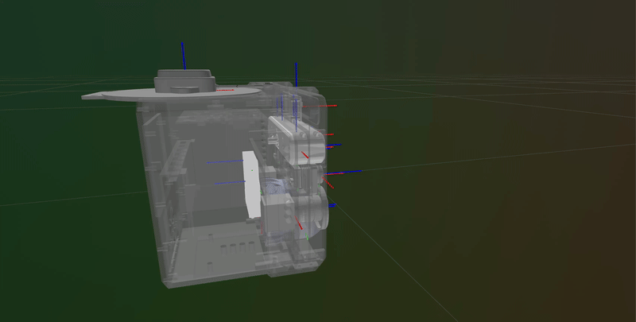

# tstar_description

URDF description package for the TartanStar sensor rig. Contains the xacro model, STL meshes, and a Python library for querying transforms.



## Sensors

| Link | Sensor |
|------|--------|
| `body` | Main chassis |
| `gps` | GPS antenna |
| `gq7` | MicroStrain GQ7 IMU/GNSS |
| `xwr` | mmWave radar (XWR) |
| `zed_camera_link` | ZED X stereo camera |
| `thermal_left` / `thermal_right` | Thermal cameras |
| `event_left` / `event_right` | Event cameras |
| `os_dome` / `os_dome_lidar` / `os_dome_imu` | Ouster dome LiDAR + IMU |

## ROS 2 Usage

Launch the robot state publisher:

```bash
ros2 launch tstar_description robot_state.launch.py
```

Launch with RViz2 visualization:

```bash
ros2 launch tstar_description robot_state.launch.py rviz:=true
```

## Python API

Install with [uv](https://github.com/astral-sh/uv):

```bash
uv sync
```

### Load the URDF

```python
from tstar_description import load_urdf, list_frames, get_transform

sensor = load_urdf()
```

### List all frames

```python
frames = list_frames(sensor)
# ['base_link', 'body', 'event_left', 'event_right', 'gps', ...]
```

### Get a transform between frames

```python
T = get_transform("base_link", "zed_camera_link", sensor)
# 4x4 homogeneous transform matrix (numpy)
```

## Rerun Visualization

Install with the rerun extra:

```bash
uv sync --extra rerun
```

Run the visualizer:

```bash
uv run tstar-visualize
```

Then connect with:

```bash
rerun rerun+grpc://...
```
