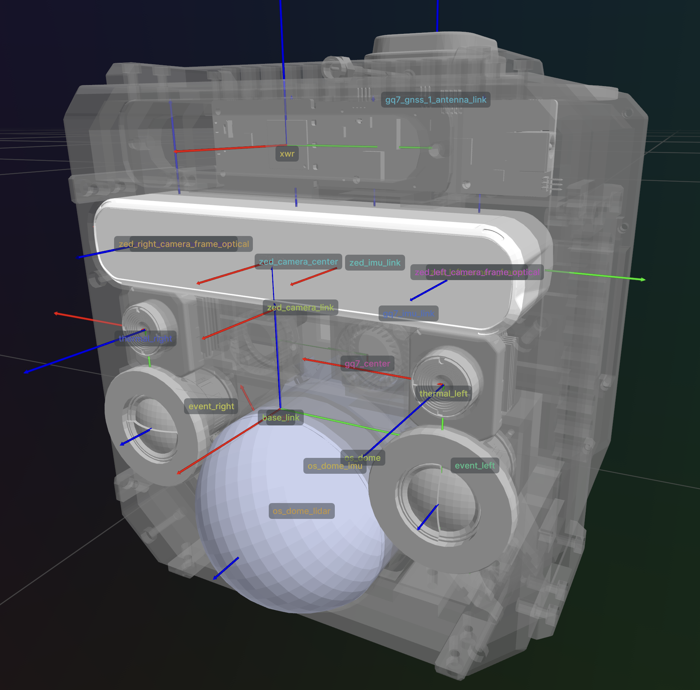

# tstar_description

[URDF description package](https://github.com/castacks/tstar_description) for the TartanStar sensor rig. Contains the xacro model, STL meshes, and a Python library for querying transforms.



## Sensors

| Link | Sensor |
|------|--------|
| `body` | Main chassis |
| `gq7_*` | MicroStrain GQ7 IMU/GNSS |
| `xwr` | mmWave radar (XWR) |
| `zed_camera_*` | ZED X stereo camera |
| `thermal_*` | Thermal cameras |
| `event_*` | Event cameras |
| `os_dome_*` | Ouster dome LiDAR + IMU |


### Load the URDF

```python
from tstar_description import load_urdf, list_frames, get_transform

sensor = load_urdf()
```

### List all frames

```python
frames = list_frames(sensor)
# ['base_link', 'body', 'event_left', 'event_right', 'gps', ...]
```

### Get a transform between frames

```python
T = get_transform("base_link", "zed_camera_link", sensor)
# 4x4 homogeneous transform matrix (numpy)
```

## Rerun Visualization

Visualize URDF with rerun:

```bash
uv run tstar-extrinsics
```

Then open rerun with:

```bash
rerun --connect
```

## ROS 2 Usage

install and build as ros2 [pkg](https://github.com/castacks/tstar_description) 

Launch the robot state publisher:

```bash
ros2 launch tstar_description robot_state.launch.py
```

Launch with RViz2 visualization:

```bash
ros2 launch tstar_description robot_state.launch.py rviz:=true
```